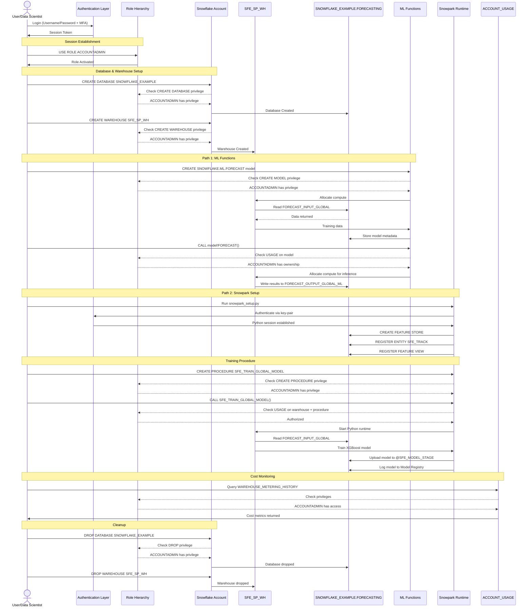

# Auth Flow - Snowflake Forecasting Lab

**Author:** SE Community  
**Last Updated:** 2025-11-24  
**Expires:** 2025-12-24 (30 days from creation)  
**Status:** Reference Implementation


**Reference Implementation:** This code demonstrates production-grade architectural patterns and best practices. Review and customize security, networking, and logic for your organization's specific requirements before deployment.

## Overview

This diagram shows authentication and authorization flows for the forecasting lab, including user authentication, role-based access control (RBAC), and privilege requirements for each forecasting path.

## Diagram



## Component Descriptions

### Authentication Methods

#### Username/Password + MFA
- **Purpose:** Standard interactive authentication for Snowsight and SnowSQL
- **Technology:** Snowflake-native authentication
- **MFA:** Optional but recommended (TOTP-based, e.g., Duo, Google Authenticator)
- **Session Duration:** Configurable (default: 4 hours)
- **Use Case:** Manual SQL execution in Snowsight

#### Key-Pair Authentication (Python)
- **Purpose:** Secure authentication for automated scripts and CI/CD
- **Technology:** RSA 2048-bit private/public key pair
- **Configuration:**
  ```python
  # In ~/.snowflake/connections.toml
  [demo]
  account = "xy12345.us-east-1"
  user = "DEMO_USER"
  private_key_path = "~/.ssh/snowflake_key.p8"
  ```
- **Benefits:**
  - No password in scripts
  - Suitable for automation
  - Auditable (key-based identity)
- **Use Case:** `python/snowpark_setup.py` execution

#### SSO/SAML (Enterprise)
- **Purpose:** Federated authentication via corporate identity provider
- **Technology:** SAML 2.0 integration
- **Not Required:** This lab uses native Snowflake authentication
- **Production Use:** Recommended for enterprise deployments

### Role Hierarchy & Privileges

#### ACCOUNTADMIN (Used in Lab)
- **Purpose:** Top-level administrative role with all privileges
- **Capabilities:**
  - Create/drop databases and warehouses
  - Manage account-level objects (resource monitors, network policies)
  - Access `ACCOUNT_USAGE` views
  - Grant privileges to other roles
- **Security Note:** Should be restricted to select users in production
- **Lab Usage:** Simplifies setup—single role for all operations

#### Production Role Architecture (Recommended)
```
ACCOUNTADMIN (Account administration)
    └── SYSADMIN (System administration)
        └── DATA_ENGINEER (ETL/pipeline development)
            └── DATA_ANALYST (Read-only analytics)
```

### Required Privileges by Operation

#### Database & Warehouse Setup (ACCOUNTADMIN)
| Operation | Privilege Required | Object | Granted To |
|-----------|-------------------|--------|------------|
| `CREATE DATABASE` | `CREATE DATABASE` | Account | ACCOUNTADMIN |
| `CREATE WAREHOUSE` | `CREATE WAREHOUSE` | Account | ACCOUNTADMIN |
| `CREATE SCHEMA` | `USAGE` on database | Database | Object owner |
| `CREATE TABLE` | `USAGE` on schema | Schema | Object owner |

#### ML Functions Path (Minimal: SYSADMIN)
| Operation | Privilege Required | Object | Notes |
|-----------|-------------------|--------|-------|
| `CREATE SNOWFLAKE.ML.FORECAST` | `USAGE` on warehouse | Warehouse | Model owner role |
| `model!FORECAST()` | `USAGE` on model | Model | Inference role |
| `SELECT` from output table | `SELECT` on table | Table | Consumer role |

**Production RBAC Example:**
```sql
-- Data engineer creates model
USE ROLE DATA_ENGINEER;
CREATE SNOWFLAKE.ML.FORECAST model_name(...);

-- Analyst queries forecast
USE ROLE DATA_ANALYST;
GRANT USAGE ON MODEL model_name TO ROLE DATA_ANALYST;
SELECT * FROM TABLE(model_name!FORECAST(...));
```

#### Snowpark Path (Minimal: SYSADMIN)
| Operation | Privilege Required | Object | Notes |
|-----------|-------------------|--------|-------|
| `CREATE PROCEDURE` | `USAGE` on schema | Schema | Procedure owner |
| `CALL procedure()` | `USAGE` on procedure + warehouse | Procedure, Warehouse | Execution role |
| Feature Store operations | `USAGE` on database/schema | Database, Schema | Feature engineering role |
| Model Registry | `USAGE` on database/schema | Database, Schema | Model owner role |
| Upload to stage | `WRITE` on stage | Stage | Upload role |
| Read from stage | `READ` on stage | Stage | Inference role |

**Production RBAC Example:**
```sql
-- ML engineer creates and trains
USE ROLE ML_ENGINEER;
CREATE PROCEDURE SFE_TRAIN_GLOBAL_MODEL() ...;
CALL SFE_TRAIN_GLOBAL_MODEL();

-- Data scientist runs inference
USE ROLE DATA_SCIENTIST;
GRANT USAGE ON PROCEDURE SFE_FORECAST_GLOBAL TO ROLE DATA_SCIENTIST;
CALL SFE_FORECAST_GLOBAL('Global');
```

#### Monitoring & Cost Analysis (ACCOUNTADMIN or GRANTED)
| Operation | Privilege Required | Object | Notes |
|-----------|-------------------|--------|-------|
| `SELECT` from `ACCOUNT_USAGE` | `IMPORTED PRIVILEGES` on `SNOWFLAKE` database | Database | Requires explicit grant |
| Query warehouse metrics | `MONITOR` on warehouse | Warehouse | View-only access |
| View query history | `IMPORTED PRIVILEGES` on `SNOWFLAKE` | Database | 365-day retention |

**Grant Pattern for Non-ACCOUNTADMIN Roles:**
```sql
USE ROLE ACCOUNTADMIN;
GRANT IMPORTED PRIVILEGES ON DATABASE SNOWFLAKE 
  TO ROLE DATA_ENGINEER;
```

### Object Ownership & Privileges

#### Ownership Model
- **Creator Ownership:** User/role that creates an object owns it by default
- **Inheritance:** Owner has ALL privileges (SELECT, INSERT, UPDATE, DELETE, DROP)
- **Transfer:** Ownership can be transferred via `GRANT OWNERSHIP`
- **Cleanup:** Object owner can drop objects (used in cleanup script)

#### Warehouse Access Control
| Privilege | Capability | Typical Role |
|-----------|------------|--------------|
| `USAGE` | Execute queries on the warehouse | DATA_ANALYST, DATA_ENGINEER |
| `MONITOR` | View warehouse metrics (no query execution) | DATA_ANALYST |
| `OPERATE` | Suspend, resume, scale warehouse | DATA_ENGINEER |
| `MODIFY` | Alter warehouse properties | SYSADMIN |
| `OWNERSHIP` | All of the above + drop warehouse | ACCOUNTADMIN |

**Lab Configuration:**
```sql
-- ACCOUNTADMIN has OWNERSHIP on SFE_SP_WH
-- Therefore: full control (usage, monitoring, modification, drop)
```

### Security Best Practices

#### Authentication
- ✅ **Enable MFA:** For all interactive users
- ✅ **Use Key-Pair Auth:** For automated scripts and CI/CD
- ✅ **Rotate Keys:** Every 90 days minimum
- ✅ **Restrict ACCOUNTADMIN:** Assign to 2-3 senior administrators only

#### Authorization
- ✅ **Least Privilege:** Grant minimum required privileges
- ✅ **Role Separation:** Use custom roles instead of system roles
- ✅ **Object Grants:** Grant on specific objects, not entire schemas
- ✅ **Regular Audits:** Review grants via `SHOW GRANTS TO ROLE role_name`

#### Network Security
- ✅ **Network Policies:** Restrict account access by IP range (optional)
- ✅ **PrivateLink:** Use AWS/Azure PrivateLink for private connectivity (optional)
- ✅ **No Credential Storage:** Never hardcode credentials in scripts
- ✅ **Environment Variables:** Use `os.getenv()` for secrets in Python

#### Monitoring & Auditing
- ✅ **Query Tags:** Tag all workloads for cost attribution
- ✅ **Access History:** Monitor `ACCESS_HISTORY` view for sensitive data access
- ✅ **Failed Logins:** Monitor `LOGIN_HISTORY` for unauthorized access attempts
- ✅ **Resource Monitors:** Set credit quotas to prevent cost overruns

### Credential Management

#### Python Client Configuration
**Recommended Approach:**
```toml
# ~/.snowflake/connections.toml (never commit to git)
[demo]
account = "xy12345.us-east-1"
user = "DEMO_USER"
role = "ACCOUNTADMIN"
warehouse = "SFE_SP_WH"
database = "SNOWFLAKE_EXAMPLE"
schema = "FORECASTING"
private_key_path = "~/.ssh/snowflake_key.p8"
```

**Script Usage:**
```python
from snowflake.snowpark import Session

# Automatically loads from ~/.snowflake/connections.toml
session = Session.builder.config("connection_name", "demo").create()
```

**Environment Variable Approach:**
```bash
export SNOWFLAKE_ACCOUNT="xy12345.us-east-1"
export SNOWFLAKE_USER="DEMO_USER"
export SNOWFLAKE_PRIVATE_KEY_PATH="~/.ssh/snowflake_key.p8"
```

```python
import os
from snowflake.snowpark import Session

session = Session.builder.configs({
    "account": os.getenv("SNOWFLAKE_ACCOUNT"),
    "user": os.getenv("SNOWFLAKE_USER"),
    "private_key_path": os.getenv("SNOWFLAKE_PRIVATE_KEY_PATH"),
    # ... other configs
}).create()
```

#### Key Generation (One-Time Setup)
```bash
# Generate private key
openssl genrsa 2048 | openssl pkcs8 -topk8 -inform PEM -out snowflake_key.p8 -nocrypt

# Extract public key
openssl rsa -in snowflake_key.p8 -pubout -out snowflake_key.pub

# Assign public key to Snowflake user
# ALTER USER DEMO_USER SET RSA_PUBLIC_KEY='MIIBIjANBgkq...';
```

### Access Patterns Summary

| User Type | Role | Authentication | Use Case | Privileges |
|-----------|------|----------------|----------|------------|
| Administrator | ACCOUNTADMIN | Username/Password + MFA | Account setup, monitoring | All privileges |
| Data Engineer | SYSADMIN | SSO or key-pair | Pipeline development | Create/modify objects |
| Data Scientist | DATA_SCIENTIST | SSO | Model training/inference | Execute procedures, read data |
| Analyst | DATA_ANALYST | SSO | BI queries | Read-only on output tables |
| Automation | SERVICE_ACCOUNT | Key-pair | Scheduled tasks | Execute procedures |

## Change History

See `.cursor/DIAGRAM_CHANGELOG.md` for version history.


