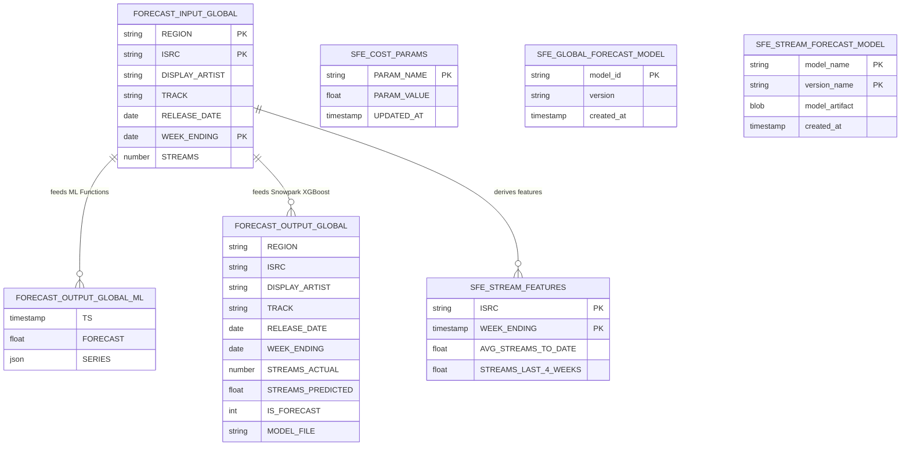

# Data Model - Snowflake Forecasting Lab

**Author:** SE Community  
**Last Updated:** 2025-11-24  
**Expires:** 2025-12-24 (30 days from creation)  
**Status:** Reference Implementation

**Reference Implementation:** This code demonstrates production-grade architectural patterns and best practices. Review and customize security, networking, and logic for your organization's specific requirements before deployment.

## Overview

This diagram shows the complete data model for the forecasting lab, including input tables, feature store entities, model registry artifacts, and output tables for both ML Functions and Snowpark XGBoost approaches.

## Diagram

## Component Descriptions

### Input Layer

#### FORECAST_INPUT_GLOBAL
- **Purpose:** Primary input table containing historical time-series streaming data for music tracks
- **Technology:** Snowflake native table
- **Location:** `SNOWFLAKE_EXAMPLE.FORECASTING.FORECAST_INPUT_GLOBAL`
- **Dependencies:** None (landing zone for synthetic data)
- **Key Columns:**
  - `REGION`: Geographic region (Global, US)
  - `ISRC`: International Standard Recording Code (unique track identifier)
  - `WEEK_ENDING`: Date of the week ending (time dimension)
  - `STREAMS`: Number of streams for the week (target variable)
- **Volume:** ~312 rows (3 tracks × 52 weeks × 2 regions)

### Feature Engineering Layer

#### SFE_STREAM_FEATURES (Feature Store)
- **Purpose:** Feature view containing derived time-series features for ML training
- **Technology:** Snowflake Feature Store (managed feature view)
- **Location:** Feature Store entity `SFE_TRACK` with feature view `SFE_STREAM_FEATURES`
- **Dependencies:** `FORECAST_INPUT_GLOBAL` (source table)
- **Key Features:**
  - `AVG_STREAMS_TO_DATE`: Rolling average of all streams up to current week
  - `STREAMS_LAST_4_WEEKS`: Sum of streams over trailing 4-week window
- **Refresh:** On-demand via Python script or scheduled task

### Model Layer

#### SFE_GLOBAL_FORECAST_MODEL (ML Functions Path)
- **Purpose:** Native Snowflake ML forecasting model (ARIMA-based)
- **Technology:** `SNOWFLAKE.ML.FORECAST` function
- **Location:** `SNOWFLAKE_EXAMPLE.FORECASTING.SFE_GLOBAL_FORECAST_MODEL`
- **Dependencies:** `FORECAST_INPUT_GLOBAL` (training data)
- **Training:** Single SQL statement creates and trains model
- **Inference:** `model!FORECAST(FORECASTING_PERIODS => 12)` syntax

#### SFE_STREAM_FORECAST_MODEL (Snowpark Path)
- **Purpose:** Custom XGBoost regression model for stream prediction
- **Technology:** Snowflake Model Registry + XGBoost
- **Location:** Model Registry in `SNOWFLAKE_EXAMPLE.FORECASTING`
- **Dependencies:** `SFE_STREAM_FEATURES` (feature inputs)
- **Training:** Python stored procedure `SFE_TRAIN_GLOBAL_MODEL()`
- **Inference:** Python stored procedure `SFE_FORECAST_GLOBAL(REGION)`
- **Artifact Storage:** `@SFE_MODEL_STAGE/SFE_MODEL_GLOBAL_XGB_FULL.pkl`

### Output Layer

#### FORECAST_OUTPUT_GLOBAL_ML
- **Purpose:** Forecast results from native ML Functions path
- **Technology:** Snowflake table (output of `model!FORECAST()`)
- **Location:** `SNOWFLAKE_EXAMPLE.FORECASTING.FORECAST_OUTPUT_GLOBAL_ML`
- **Dependencies:** `SFE_GLOBAL_FORECAST_MODEL` (inference model)
- **Refresh:** Ad-hoc query or scheduled task `SFE_TASK_FORECAST_ML`

#### FORECAST_OUTPUT_GLOBAL
- **Purpose:** Forecast results from Snowpark XGBoost path with actuals comparison
- **Technology:** Snowflake table (written by Snowpark stored procedure)
- **Location:** `SNOWFLAKE_EXAMPLE.FORECASTING.FORECAST_OUTPUT_GLOBAL`
- **Dependencies:** `SFE_STREAM_FORECAST_MODEL` (XGBoost model)
- **Refresh:** Scheduled task `SFE_TASK_FORECAST_GLOBAL` or manual execution
- **Special Features:**
  - Contains both actual and predicted values
  - `IS_FORECAST` flag distinguishes observed vs predicted rows
  - `MODEL_FILE` tracks which model version generated predictions

### Support Tables

#### SFE_COST_PARAMS
- **Purpose:** Configurable cost parameters for warehouse cost estimation
- **Technology:** Snowflake table (configuration storage)
- **Location:** `SNOWFLAKE_EXAMPLE.FORECASTING.SFE_COST_PARAMS`
- **Dependencies:** None
- **Key Parameters:**
  - `DOLLARS_PER_CREDIT`: Cost per compute credit (contract-specific)
  - `SP_WH_MEDIUM_CREDITS_PER_HOUR`: Credit rate for Snowpark warehouse

## Entity Relationships

- **One-to-Many:** `FORECAST_INPUT_GLOBAL` → `FORECAST_OUTPUT_GLOBAL_ML` (one input week generates multiple forecast weeks)
- **One-to-Many:** `FORECAST_INPUT_GLOBAL` → `FORECAST_OUTPUT_GLOBAL` (one input week generates features and predictions)
- **Derived:** `SFE_STREAM_FEATURES` is a derived feature view (not materialized), computed from `FORECAST_INPUT_GLOBAL`
- **Model Artifacts:** Both models store serialized artifacts externally (ML Functions internally, Snowpark in stage)

## Data Quality Rules

- `STREAMS` must be non-negative
- `WEEK_ENDING` must be a Saturday (week-ending convention)
- `ISRC` must be unique per track
- `REGION` must be one of: 'Global', 'US'
- Feature engineering requires minimum 10 weeks of history per track

## Change History

See `.cursor/DIAGRAM_CHANGELOG.md` for version history.

